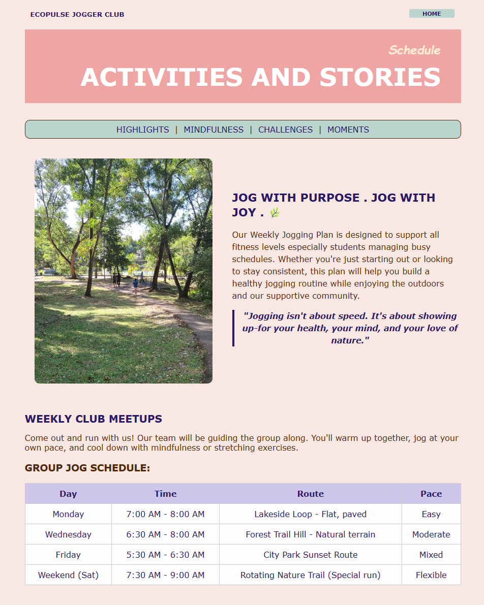
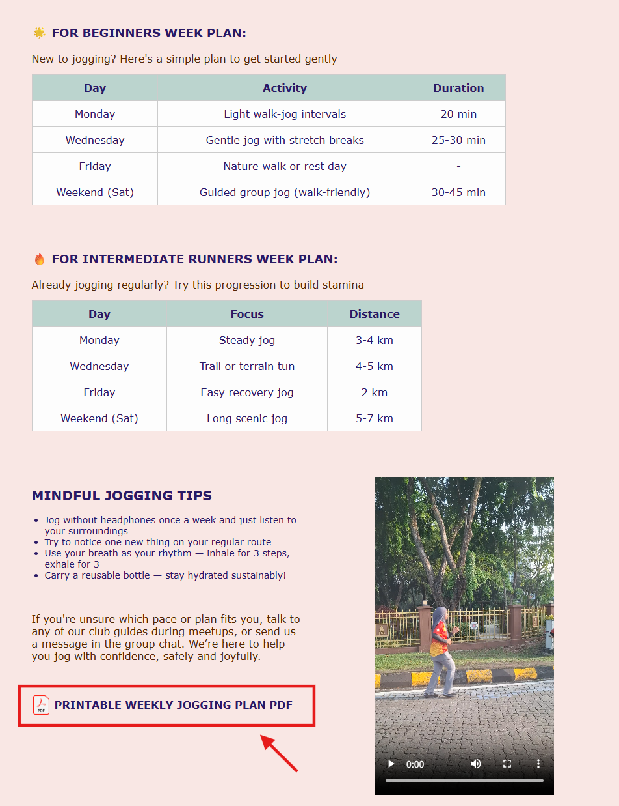
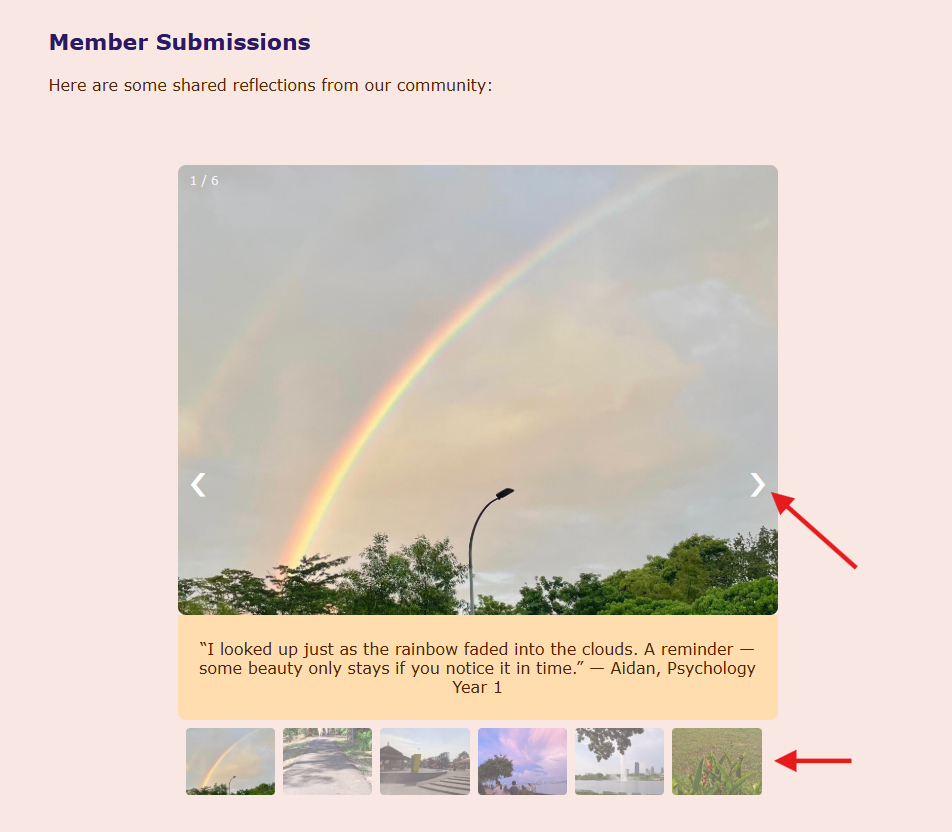
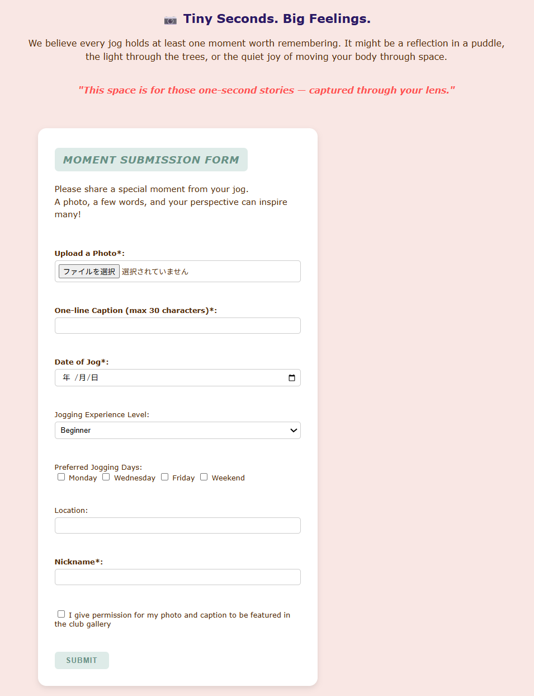

# Ecopulse Jogger Club Website

## Overview
This project is a web-based jogging community platform developed as part of a group assignment.  
It was designed to encourage healthy habits, user engagement, and community participation through structured jogging plans, interactive features, and media-supported content.

---

## My Contribution

I was responsible for selected front-end pages and user interaction features of the website.

My main contributions included:
- Designing and implementing structured content pages using HTML and CSS
- Developing interactive elements using JavaScript
- Creating a member submissions carousel for dynamic content display
- Designing a user submission form for community participation
- Integrating supportive media content such as images, video, and printable resources

---

## Featured Pages and Functions

### Activities & Stories Page
This page presents jogging-related content in a clear and organized layout, including schedules, weekly plans, and reflective content for users.

---

### Weekly Plan and Printable PDF Support
This section provides structured jogging plans for different experience levels.  
A printable weekly jogging plan PDF is also included to support offline use and continuous engagement beyond the website.

---

### Member Submissions Carousel
This feature was implemented using JavaScript to create an interactive image carousel that displays community-submitted jogging moments.  
It improves engagement by allowing users to browse shared reflections dynamically.

---

### Moment Submission Form
This form allows users to contribute their own jogging experiences by submitting a photo, caption, date, preferences, and other related details.  
It was designed to support user-generated content and strengthen community interaction.

---

## UX Design Focus

This project was designed with the following user experience goals in mind:
- Clear and structured information presentation
- Interactive engagement through JavaScript-based features
- Community participation through user submissions
- Continuous user support through printable offline resources
- A calm and approachable visual style suitable for a wellness-focused community platform

---

## Technologies Used
- HTML
- CSS
- JavaScript

---

## Notes
This repository contains the full group project files to preserve complete functionality of the website.

Some large media files, particularly certain `.mp4` files, are not included in this repository because GitHub has file size limitations for standard uploads.  
Only the necessary and representative media files are included to keep the project accessible and maintainable while preserving the main user experience and functionality.

My contribution is specifically reflected in the pages and interface elements shown above.

---

## How to Run

1. Download or clone this repository
2. Open the main HTML file in your browser
3. Ensure that the included image, CSS, JavaScript, PDF, and video files remain in their original relative paths for proper display and interaction

---

## 日本語補足

本プロジェクトは、ジョギングを通じた健康習慣とコミュニティ参加を促すことを目的としたグループWeb制作課題です。

私は主に以下の部分を担当しました：
- HTML / CSS を用いたページ設計とレイアウト実装
- JavaScript を用いたカルーセルなどのインタラクション実装
- ユーザー投稿フォームの設計
- PDFや画像・動画を活用したユーザー体験の向上

※ 一部の mp4 ファイルは GitHub の容量制限のため含めていませんが、サイトの主要な構成・機能・体験が分かるように必要な要素は残しています！
